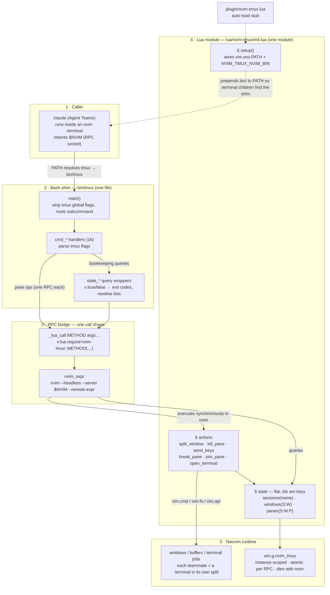
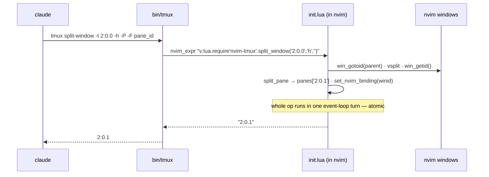

# nvim-tmux


> **Status: alpha.** Targets Claude Code's experimental Agent Teams feature. The Claude binary's tmux call surface drifts; expect breakage on Claude updates and pin a known-good version if stability matters.

A single bash file named `tmux` that impersonates tmux for the [Claude Code](https://www.anthropic.com/claude-code) binary. Claude Code's Agent Teams feature spawns teammate agents via tmux; `nvim-tmux` intercepts those tmux calls and routes them into real Neovim splits via stock `nvim --server` CLI invocations.

Two files do the work: `bin/tmux` (argv parsing — one RPC per subcommand) and `lua/nvim-tmux/init.lua` (everything else, running inside your nvim: state, window ops, terminal jobs).

## Why this project exists

Claude Code is great. Agent Teams is great. And when Anthropic shipped a way to *see* your teammate agents working side by side, they reached for the one terminal multiplexer everybody has: tmux. Fair enough.

But if you live in Neovim, you already *have* a multiplexer. Splits, tabs, `:terminal` with full job control, a scriptable window manager with a real API — that's the editor. Running tmux underneath nvim to get... panes... means two nested grids fighting over your keybindings, two scrollback models, two status lines, and a `$TERM` matryoshka, all to duplicate something nvim does natively.

Granted, "hardcore Neovim users who run Claude inside `:terminal` and refuse tmux on principle" is not a huge market. But turns out that making a small script that impersonates tmux is enough to fool Claude Code into using it.

## What it does

Claude Code runs `tmux split-window`, `tmux send-keys`, `tmux new-session`, ... to orchestrate teammate agents. With `nvim-tmux` on `PATH` in place of real tmux, those calls become:

| Claude's tmux call | What the shim does to your nvim |
| :--- | :--- |
| `tmux split-window` | `:vsplit` (or `:split`) off the target pane, bind new winid to state |
| `tmux send-keys -t <pane> <keys> Enter` | Opens `:terminal` on first contact, then `chansend(chan_id, bytes)` |
| `tmux kill-pane` | `nvim_buf_delete(bufnr, force=true)` — closes the window and reaps the job |
| `tmux select-pane -t <pane> [-T title]` | `win_gotoid(winid)`, sets winbar title |
| `tmux new-session / new-window` | State-only bookkeeping; windows materialise lazily |
| `tmux break-pane / join-pane` | Close the window but preserve the terminal buffer; restore later with `:buffer <bufnr>` |

Teammates appear as real nvim splits in the same nvim that launched Claude. Killing a teammate from Claude collapses the split. Whenever a teammate's shell dies — Claude's spawn command ends in an `exit`, so a finished agent takes its shell down with it; typing `exit` into the pane yourself does the same — a `TermClose` autocmd wipes the buffer and the split collapses, instead of lingering as `[Process exited 0]`.

## Requirements

- macOS or Linux
- Neovim ≥ 0.9
- `bash` (3.2+ on macOS), POSIX coreutils (`jq` only for running the test suite)
- No real tmux on `PATH` ahead of `nvim-tmux` — this shim replaces it rather than coexisting.

## Install

Add it to your plugin manager of choice. The plugin prepends its bundled `bin/` to `vim.env.PATH`, so `tmux` inside any `:terminal` resolves to our shim — no system-level install or `$PATH` editing needed.

```vim
-- lazy.nvim
{ "rubensf/nvim-tmux" }

-- packer.nvim
use "rubensf/nvim-tmux"

-- mini.deps
MiniDeps.add("rubensf/nvim-tmux")

-- vim-plug
Plug 'rubensf/nvim-tmux'

-- dein.vim
call dein#add('rubensf/nvim-tmux')
```

```bash
# native packages (:h packages), no plugin manager
git clone https://github.com/rubensf/nvim-tmux.git \
  ~/.local/share/nvim/site/pack/plugins/start/nvim-tmux
```

That's it. Zero config. On startup the plugin:

- Prepends `<plugin>/bin` to `vim.env.PATH` (only inside nvim — your login shell is untouched).
- Sets `NVIM_TMUX_NVIM_BIN` to the running nvim binary, bypassing any `nvr`-style wrapper on your `PATH`.
- Warns via `vim.notify` if the shim is missing/non-executable or `bash` isn't on `PATH`.

To opt out without uninstalling: `vim.g.nvim_tmux_disable = true` before plugin load. To pass options, set `vim.g.loaded_nvim_tmux = 1` to suppress auto-load and call `require("nvim-tmux").setup({...})` yourself. Supported options: `shim_dir`, `enabled`, `set_nvim_bin`.

Verify from inside a `:terminal`:

```bash
which tmux           # expect: <plugin-dir>/bin/tmux
tmux -V              # expect: tmux 3.0 (nvim-tmux v<semver>)
```

## Run Claude under it

1. Enable Agent Teams (if not already on). In `~/.claude/settings.json` under `env`:
   ```json
   {
     "env": {
       "CLAUDE_CODE_EXPERIMENTAL_AGENT_TEAMS": "1"
     }
   }
   ```
   Claude picks the tmux backend automatically when it finds `tmux` on `PATH`. If yours doesn't, force it with `"teammateMode": "tmux"` in `~/.claude.json`.
2. Launch `nvim`. Open `:terminal`. Nvim automatically sets `$NVIM` in the terminal's environment — that's the RPC socket the shim talks back to.
3. Inside the `:terminal`, run `claude`. When Claude spawns teammates, the shim materialises them as nvim splits in the same window.

## Environment

| Variable | Required? | Purpose |
| :--- | :--- | :--- |
| `$NVIM` | yes (set by nvim for `:terminal` children) | RPC socket of the target nvim instance |
| `$NVIM_LISTEN_ADDRESS` | fallback | legacy (nvim < 0.7) alternative to `$NVIM` |
| `$NVIM_TMUX_NVIM_BIN` | optional | real nvim binary path; set this if your `nvim` on `PATH` is a wrapper script (e.g. `nvr`). Default: `nvim`. |

## Troubleshooting

- **`nvim-tmux: nvim: no $NVIM socket`** — shim was run from a shell with no parent nvim. Only supported runtime is a `:terminal` child of a live nvim.
- **Garbled `--remote-expr` output / `E119` errors** — check that `NVIM_TMUX_NVIM_BIN` points at a real nvim binary (not a `nvr`-style wrapper).
- **A teammate ended up in the leader's terminal** — stale winids in `vim.g.nvim_tmux`. Reset from inside that nvim: `:lua vim.g.nvim_tmux = nil`.
- **`Error: Could not determine pane count for swarm window`** — Claude update introduced a format token or call shape the shim doesn't handle yet. Open an issue with the failing `tmux` invocation.

For Claude Code sessions, there's a project skill at `.claude/skills/nvim-tmux/SKILL.md` — invoke it with `/nvim-tmux` to give Claude a debug runbook.

## Scope

- **Target Claude binary:** 2.1.114 – 2.1.118 (audited surface). Newer versions handled as follow-up work when they drift.
- **Out of scope:** interactive tmux usage, coexistence with real tmux, Windows, user-level tmux configuration, visual parity with real tmux borders/titles.
- **Layout geometry:** `select-layout main-vertical|tiled` resolves to `:wincmd =` (equalize windows) rather than composing tmux's exact visual arrangement. Structural correctness matters to Claude; visual fidelity does not.

## Architecture



The flow for one subcommand, end to end:



Why state lives inside nvim: each `tmux` invocation is a fresh short-lived process, so session state must survive *between* invocations. The long-lived nvim process is the natural home — the single-threaded event loop makes every operation atomic (no locks, no state files), scoping is per-instance for free, and the state dies with the editor.

## Development

```bash
make test           # unit + integration + e2e
make test-unit      # bash-level, no nvim required
make test-int       # spawns headless nvim, end-to-end per subcommand
make test-e2e       # scripted Claude Agent Teams flows
make lint           # shellcheck
```

Cross-module contracts (state schema, send-keys grammar, transport helpers, exit conventions) live in [`docs/CONTRACTS.md`](docs/CONTRACTS.md). A richer visual overview (state shape, install paths, full data-flow trace) is at [`docs/architecture.html`](docs/architecture.html) — open it in a browser.

## Repository layout

```
bin/tmux                  the whole bash side: argv parsing + cmd_* handlers,
                          nvim_expr transport, _lua_call dispatcher, state_*
                          RPC wrappers

plugin/nvim-tmux.lua      Neovim auto-loader; runs setup() on startup
lua/nvim-tmux/init.lua    the whole Lua side: state bookkeeping in
                          vim.g.nvim_tmux, the tmux->nvim pane/terminal
                          actions, and setup() PATH wiring

tests/
  unit/*.bats               bash-only, no nvim (dispatch, -V, argv edges)
  integration/*.bats        spawn `nvim --headless`; drive bin/tmux end-to-end,
                            one file per subcommand
  e2e/*.sh                  scripted Agent Teams sequences

docs/
  CONTRACTS.md              cross-module interface contracts (state schema,
                            send-keys grammar, transport helpers, exit codes)
  architecture.html         visual overview — layers, data flow, state shape

.claude/skills/nvim-tmux/ SKILL.md — debug runbook auto-loaded by future
                          Claude Code sessions in this repo

.github/                  CI workflow + issue/PR templates

Makefile, VERSION         test/lint targets + the version string
README.md, CONTRIBUTING.md, LICENSE
```

Why the flat top-level layout (instead of `shim/` and `nvim/` subdirs): Neovim plugin managers auto-discover `plugin/*.lua` and `lua/<name>/init.lua` only when those directories sit at the rtp root. Moving them under a subdirectory would force every user to manually adjust their runtimepath before the plugin can self-register — defeating zero-config install.

## Contributing

Contributions welcome. See [`CONTRIBUTING.md`](CONTRIBUTING.md) for dev setup, test/lint workflow, and how to file useful bug reports.

## License

MIT — see [`LICENSE`](LICENSE).
